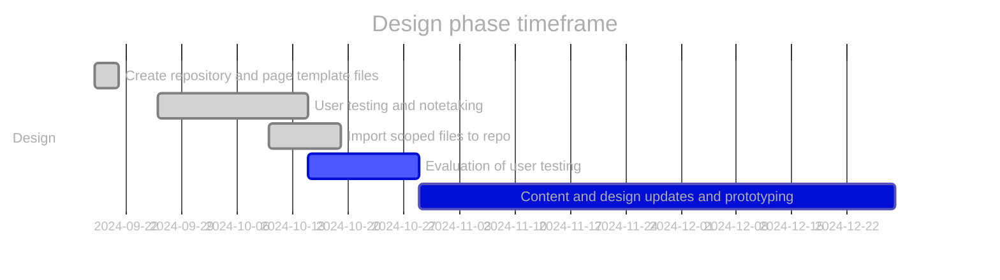
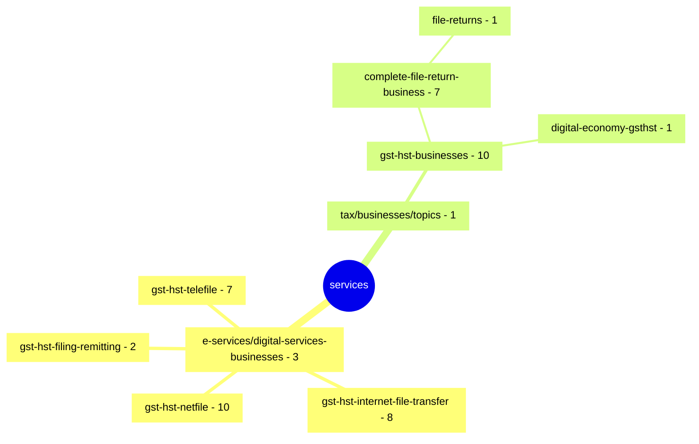

# GST/HST for Small Business [COP FY2024]

Project to optimize the content related to filing GST/HST returns.

**COP Timeframe:** [July 31, 2024 - February 2025]

## Important links

- [\[GST COP\] Scoped inventory page \(github\)](https://test.canada.ca/cops/gst-hst-business/index.html)
- [Github.dev](https://github.dev/cra-proto/gst-hst-business/blob/main/)
- [Github Canada.ca page template \(Jekyll\)](https://github.com/cra-proto/gst-hst-business/blob/main/templates/page_template_jekyll-en.html)
- [Github Canada.ca page template \(CDTS\)](https://github.com/cra-proto/gst-hst-business/blob/main/templates/page_template-e.html)

## Update procedures:

- Test development files will have `_proto#` appended to the end of the file name
- Changes will be committed by selecting `create a new branch` and then performing a `pull request` to merge the updated content
- Updates should have comments identifying what has been updated
- Any repository path structure changes should be communicated to all indivduals who directly update the repository

---

## Deleted files list

- None

## Design phase roadmap:

- [ ] Prototype: co-design navigation and content
- [ ] SME review and accuracy check
- [ ] Validation usability testing (including accessibility review)
- [ ] Refine prototype (if required)
- [ ] Spot check usability (if required)



\* future dates may be placeholders.

## Canada.ca path structure of scoped files

[https://www.canada.ca/en/revenue-agency/services/](https://www.canada.ca/en/revenue-agency/services/e-services/digital-services-businesses/) \[50 pages\]



## GCWeb Jekyll page template example

```yaml
---
layout: [default]                                  # Available: core, default, fluid, layout-home, layout-servermesssage, layout-splashpage, no-container, without-h1
title: "The title of the current page"             # This value will set the title and h1 tag
sectionTitle: "Section title for the page"         # This value will set the section title above the h1 tag
titleH1: "The header of the current page"          # This value will set the h1 tag (title over rides)
lang: [en | fr]                                    # Either "en" or "fr"
description: "Description of the current page"     # Optional. Metadata description
subject: "the subject of the current page"         # Optional. Metadata subject
auth:
  type: [signedoff | active | contextual]          # Optional. Creates and configures a sign in button
  label: "Sign in button label"                    # Label of the sign in button
  labelExtended: "Sign in button extended label"   # Extended label of the sign in button
  link: "The url"                                  # link of the sign in button
altLangPage: "The url"                             # Optional. Use the url of the alternate language page to display the language toggle
dateModified: YYYY-MM-DD                           # ISO date
dateIssued: YYYY-MM-DD                             # Optional. ISO date
breadcrumbs:                                       # By default the Canada.ca breadcrumbs is already set
  - title: "The title"
    link: "The url"
css: "https://domain.ca/your-stylesheet.css"       # Optional. You can add custom css to your page
script: "https://domain.ca/your-awesome-script.js" # Optional. You can add custom javascript to your page
---

<p>Content that would be displayed on the page</p>
```

## Resources

- [User Centered Design Guide](https://design.cra-arc.alpha.canada.ca/en/index.html)
- [GCWeb, the WET-BOEW Canada.ca theme](https://wet-boew.github.io/GCWeb/index-en.html)
- [Mermaid markdown documentation](https://mermaid.js.org/intro/getting-started.html)
- [Jekyll theme for GCWeb](https://github.com/wet-boew/gcweb-jekyll)
- [Testing your GitHub Pages site locally with Jekyll](https://docs.github.com/en/pages/setting-up-a-github-pages-site-with-jekyll/testing-your-github-pages-site-locally-with-jekyll)
- [Learn YAML in Y minutes](https://learnxinyminutes.com/docs/yaml/)
- [Centrally Deployed Templates Solutions \(CDTS\) - Internet](https://cenw-wscoe.github.io/sgdc-cdts/docs/internet-nodocwrite-en.html)

**Updated:**  2024-11-06
